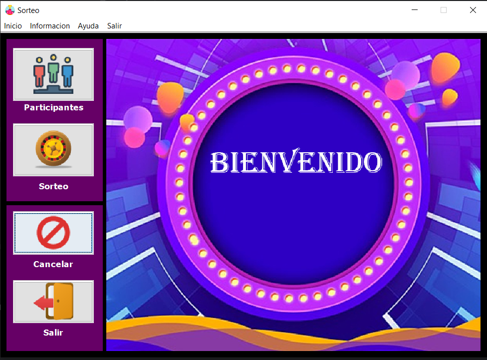
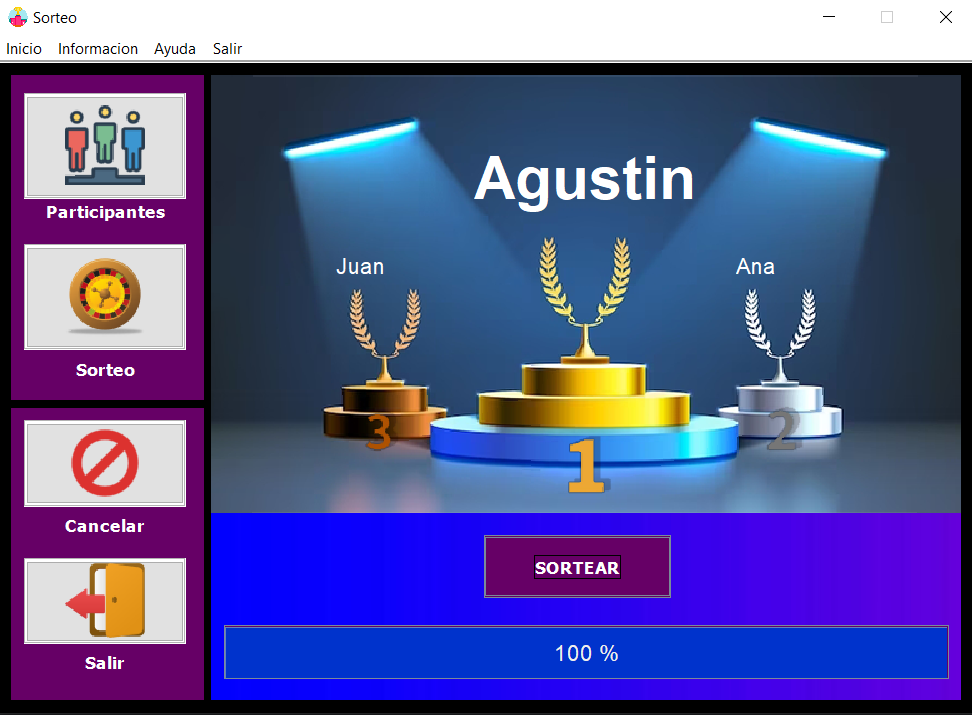

# 🎲 Sorteo desde Excel – Aplicación Java

Aplicación desarrollada en **Java** que permite leer un archivo **Excel** con datos de participantes y realizar un **sorteo aleatorio**, seleccionando uno o más ganadores según la lógica definida.

Este proyecto fue desarrollado **desde cero**, de manera independiente, con el objetivo de resolver un problema concreto y practicar el procesamiento de datos externos en Java.

---

## 📸 Screenshots

### Pantalla de inicio
Pantalla de bienvenida


### Pantalla sorteo
Pantalla para mostrar resultados del sorteo


### Pantalla carga de participantes
Pantalla para cargar la tabla de participantes para el sorteo


---

## 🎯 Objetivo del proyecto

- Leer datos desde un archivo Excel
- Procesar información externa en Java
- Aplicar lógica de negocio (sorteo aleatorio)
- Manejar colecciones y datos dinámicos
- Resolver un caso de uso real

---

## 🛠️ Tecnologías utilizadas

- Java SE  
- Librería para lectura de Excel (por ejemplo: Apache POI)  
- Colecciones de Java  
- IDE: IntelliJ IDEA / NetBeans  

---

## ⚙️ Funcionalidades

- Lectura de archivo Excel
- Carga de participantes en memoria
- Selección aleatoria de ganadores
- Evita duplicados en el sorteo
- Ejecución simple desde consola

---

## 📂 Estructura del proyecto

```
main/           → Punto de entrada de la aplicación
modelo/         → Representación de los participantes y la tabla 
vista/          → Manejo de interfaz gráfica y eventos 
img/            → Recursos visuales del proyecto
docs/           → Almacena planilla de excel para pruebas y capturas de pantallaS
```

---

## 🧠 Enfoque técnico

- Procesamiento de archivos externos
- Lógica de negocio desacoplada
- Uso de colecciones para manejo dinámico de datos
- Código claro y mantenible

Este tipo de aplicaciones representa un **caso real frecuente en backend**, donde los datos provienen de fuentes externas y deben ser procesados correctamente.

---

## 📌 Notas importantes

- Proyecto de consola / desktop
- No utiliza frameworks web
- No utiliza base de datos
- Enfocado en lógica y procesamiento de datos

---

## 📈 Aprendizajes obtenidos

- Lectura de archivos Excel en Java
- Manejo de datos externos
- Uso de colecciones y lógica aleatoria
- Resolución de problemas reales

---

## 👨‍💻 Autor

Desarrollado por **Gonzalo Castellano**  
Desarrollador Java Backend Junior
